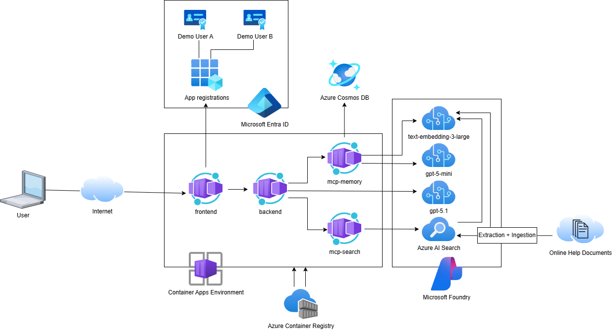
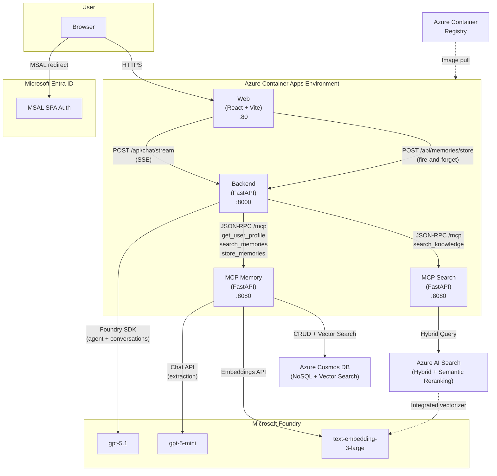

# Agent Memory with Azure Cosmos DB

A reference solution for designing AI agents with persistent, user-scoped long-term memory. Memories are automatically extracted from conversations using OpenAI GPT structured output, vectorized, deduplicated via vector similarity, and stored in Azure Cosmos DB. On every new conversation, the agent recalls the user's identity and preferences — so it remembers who you are, what you care about, and what you've discussed before.

The system deploys as four containerized services on Azure Container Apps, orchestrated by Microsoft Foundry, with zero secrets (managed identity everywhere) and a single `azd up` command.

## Getting Started

### Prerequisites

- [Azure Developer CLI (azd)](https://learn.microsoft.com/azure/developer/azure-developer-cli/install-azd)
- [Azure CLI](https://learn.microsoft.com/cli/azure/install-azure-cli)
- [Docker](https://docs.docker.com/get-docker/) (for building container images)
- An account with Azure subscription with the following RBAC permissions:
  -  **Owner** (or Contributor + User Access Administrator) to create resources and assign RBAC roles
  - **Application Administrator** (or Cloud Application Administrator) role in Microsoft Entra ID — Bicep creates an app registration via Microsoft Graph
  - **User Administrator** role in Microsoft Entra ID — the post-provision script creates demo users

All service-to-service RBAC roles listed in [RBAC Role Assignments](#rbac-role-assignments) are assigned automatically by the Bicep deployment.

### Deploy

First, sign in to the Azure CLI:

```bash
az login
```

Next, sign in to the Azure Developer CLI
```bash
azd auth login
```

After you've successfully authenticated with both CLIs, provision all resources and deploy the services:

```bash
azd up
```

Follow the prompts to specify the environment name and Azure regions. Once deployment completes, use the frontend web URL to access the application and sign in with the provided demo user accounts.

This single command provisions all required Azure resources — including Azure Cosmos DB, Azure AI Search, Microsoft Foundry, Azure Container Apps, and Entra ID app registrations—builds and pushes Docker images, deploys all services, creates demo users, and ingests the knowledge base.

## Architecture Overview

### Azure Resources



### Service Communication Flow

The system is deployed as four Azure Container Apps that communicate over HTTPS, backed by Microsoft Foundry, Cosmos DB, and AI Search:



### Services

| Service | Tech | Port | Purpose |
|---------|------|------|---------|
| **Web** | React + Vite + MSAL | 80 | Chat UI with SSE streaming, MSAL/Entra ID authentication |
| **Backend** | FastAPI (Python) | 8000 | AI Agent via Microsoft Foundry SDK, function tool routing to MCP servers, delegates memory extraction to MCP Memory |
| **MCP Memory** | FastAPI (Python), JSON-RPC | 8080 | Owns all Cosmos DB CRUD, embedding, and memory extraction (LLM + save); exposes 5 tools via MCP protocol |
| **MCP Search** | FastAPI (Python), JSON-RPC | 8080 | Hybrid search over Azure AI Search knowledge base, exposes 1 tool via MCP protocol |

### Infrastructure (Bicep)

| Resource | Purpose |
|----------|---------|
| Azure Container Apps | Hosts web, backend, mcp-memory, and mcp-search services |
| Azure Container Registry | Stores Docker images for all four services |
| Microsoft Foundry | `gpt-5.1` for agent chat, `gpt-5-mini` for memory extraction, `text-embedding-3-large` for embeddings, plus a Foundry Project for agent/conversation management |
| Azure Cosmos DB (NoSQL, Serverless) | Memory storage with vector search (quantizedFlat, cosine, 3072 dimensions) |
| Azure AI Search | Knowledge base index with hybrid search (text + vector + semantic reranking) |
| Entra ID App Registration | SPA authentication for the web frontend |
| Log Analytics Workspace | Container Apps logging and monitoring |

### Authentication & Identity

- **User authentication**: MSAL SPA with Entra ID. Users sign in via browser redirect.
- **User ID**: `account.idTokenClaims.oid` (Entra ID Object ID) from MSAL — used as Cosmos DB partition key.
- **Service-to-service**: Managed Identity (`DefaultAzureCredential`). No secrets stored.

### RBAC Role Assignments

| Principal | Role | Target Resource | Purpose |
|-----------|------|----------------|---------|
| MCP Memory | Cosmos DB Built-in Data Contributor | Cosmos DB | Read/write memory documents |
| MCP Memory | Cognitive Services OpenAI User | Microsoft Foundry | Generate embeddings |
| Backend | Cognitive Services OpenAI User | Microsoft Foundry | Agent chat completions (conversations + responses API) |
| Backend | Azure AI User | Microsoft Foundry | Create/run agents and conversations |
| MCP Search | Search Index Data Reader | AI Search | Query the knowledge index |
| AI Search | Cognitive Services OpenAI User | Microsoft Foundry | Integrated vectorizer for hybrid search |

## Memory Categories

All memories are classified into exactly one of 8 categories using GPT structured output with a strict enum:

| Category | What it captures | Example |
|----------|-----------------|---------|
| `identity` | Who the user is — name, role, location, demographics | "The user's name is Alice." |
| `preference` | Likes, dislikes, style choices, ways of working | "The user prefers dark mode." |
| `knowledge` | Facts the user knows, expertise, skill level | "The user is proficient in Rust." |
| `goal` | Objectives, plans, aspirations | "The user is preparing for a marathon." |
| `context` | Current situation, active project, tools in use | "The user is working on a migration project." |
| `relationship` | Connections to people, teams, organizations | "The user's manager is Sarah." |
| `episode` | Summary of a notable past interaction or event | "The user resolved a production outage last week." |
| `sentiment` | Expressed feelings, attitudes about specific topics | "The user is enthusiastic about AI tooling." |

These are intentionally **mutually exclusive** and **collectively exhaustive** — every useful memory fits exactly one category, and the LLM is forced to pick from the enum.

The extraction prompt includes two examples per category to guide classification accurately.

## Cosmos DB Design

### Container

| Property | Value |
|----------|-------|
| Database name | `agentmemory` |
| Container name | `memories` |
| Partition key | `/user_id` |
| Vector index | `/embedding` (quantizedFlat, cosine, 3072 dimensions) |
| Capacity mode | Serverless |

All memory types live in a single container, differentiated by the `category` field. Every query is scoped to a single `user_id`, so all reads hit one logical partition — fast and cost-efficient.

### Document Schema

```json
{
    "id": "7a4e9bb8-9e28-489c-9c39-d513f6ee844c",
    "user_id": "a72b107d-a26b-4e6b-ac2a-8082f378e775",
    "category": "identity",
    "content": "The user's name is Mardi.",
    "embedding": [0.012, -0.034, ...],
    "tags": ["name", "mardi", "identity"],
    "source_conversation_id": "201fb265-9e75-4c53-b2c1-3ce136147ada",
    "created_at": "2026-03-11T19:01:19.021046+00:00",
    "updated_at": "2026-03-11T19:01:26.359971+00:00"
}
```

### Indexing Policy

```json
{
    "indexingMode": "consistent",
    "includedPaths": [
        { "path": "/category/?" },
        { "path": "/created_at/?" },
        { "path": "/updated_at/?" },
        { "path": "/tags/[]/?" }
    ],
    "excludedPaths": [
        { "path": "/content/?" },
        { "path": "/embedding/*" },
        { "path": "/*" }
    ],
    "vectorIndexes": [
        {
            "path": "/embedding",
            "type": "quantizedFlat"
        }
    ]
}
```

- **Exclude `/content`** — searched via vectors, not text queries.
- **Exclude `/embedding`** from standard index — use the dedicated vector index.
- **`quantizedFlat`** — suitable for up to tens of thousands of vectors per partition. Switch to `diskANN` at 100K+ memories per user.

### Vector Distance Function

The distance function used by `VectorDistance()` queries is configured in the Cosmos DB container's `vectorEmbeddingPolicy` (in `infra/modules/cosmos-db.bicep`), **not** in the SQL query itself. This project uses **cosine**:

```bicep
vectorEmbeddingPolicy: {
  vectorEmbeddings: [
    {
      path: '/embedding'
      dataType: 'float32'
      dimensions: 3072
      distanceFunction: 'cosine'    // ← change this value
    }
  ]
}
```

| Distance Function | Score Range | Ordering | Best For |
|-------------------|-------------|----------|----------|
| `cosine` (default) | 0 to 1 (higher = more similar) | Ascending | Text embeddings — measures angle between vectors, invariant to magnitude. Ideal for normalized embeddings like `text-embedding-3-large`. |
| `euclidean` | 0 to ∞ (lower = more similar) | Ascending | Cases where vector magnitude is meaningful. |
| `dotproduct` | −∞ to ∞ (higher = more similar) | Ascending | Normalized vectors where you want raw inner product. Equivalent to cosine for unit vectors. |

To switch, change the `distanceFunction` value in the Bicep file and redeploy with `azd up`. Note: if you switch to `euclidean` or `dotproduct`, the deduplication threshold in `mcp-memory/main.py` (`score_threshold=0.95`) will need to be adjusted to match the new score range.

### Partition Key Rationale

| Consideration | Detail |
|---------------|--------|
| Why `/user_id` | Every query is scoped to one user — single-partition reads |
| Max logical partition | 20 GB — a user would need millions of memories to hit this |
| Max item size | 2 MB — a memory with a 3072-dim embedding is ~12 KB |
| Hot partition risk | Low — agent memory traffic is spread across users |

## Memory Pipeline

### How Memories Are Saved (Extraction)

Memory extraction runs as a **background task** triggered by the frontend in several scenarios:

- **New chat / switch conversation** — extracts from the previous conversation
- **Periodic incremental** — every 8 new messages, with 2-message overlap for context
- **Tab/browser close** — via `navigator.sendBeacon` (fire-and-forget)
- **Logout** — synchronous extraction before sign-out completes

This keeps the chat response fast while ensuring no memories are lost.

```
┌───────────────────────────────────────────────────────────────┐
│  Trigger: new chat / periodic / beforeunload / logout         │
└───────────────────────┬───────────────────────────────────────┘
                        ▼
          ┌──────────────────────────┐
          │  Frontend: POST          │  Fire-and-forget call with
          │  /api/memories/store     │  user_id, conversation_id,
          │                          │  message slice
          └────────────┬─────────────┘
                       ▼
          ┌──────────────────────────┐
          │  Backend → MCP Memory:   │  Delegates to MCP Memory
          │  store_memories           │  store_memories tool
          │  (background task)       │  (fire-and-forget)
          └────────────┬─────────────┘
                       ▼
          ┌──────────────────────────┐
          │  MCP Memory: LLM Extract │  GPT-5-mini with structured
          │  + Save                  │  output → array of memories
          │                          │  with category, content, tags
          └────────────┬─────────────┘
                       ▼
          ┌──────────────────────────┐
          │  MCP Memory: Save        │  For each extracted memory,
          │  save_memory (JSON-RPC)  │  call save_memory tool
          └────────────┬─────────────┘
                       ▼
          ┌──────────────────────────┐
          │  MCP Memory:             │
          │  1. Embed content        │  text-embedding-3-large
          │  2. Vector search dedup  │  cosine similarity > 0.95?
          │  3. Upsert to Cosmos DB  │  update existing or insert new
          └──────────────────────────┘
```

**Key details:**
- The LLM extraction uses **GPT structured output** (`strict: true`) to guarantee a valid JSON array of memories, each with `category` (enum), `content`, and `tags`.
- The extraction prompt includes **category definitions with examples** to guide accurate classification.
- **Deduplication** happens at the MCP layer: before saving, it does a vector search for the top-3 most similar memories from the same user. If any match has cosine similarity ≥ 0.95, it updates the existing memory instead of creating a duplicate.
- Short conversations (< 2 messages) are skipped.

### How Memories Are Recalled (Retrieval)

On the **first turn** of every new conversation (no `thread_id`), the backend loads the user's profile, creates a persistent Foundry thread, and injects the profile as developer context. The agent then handles the conversation, calling `search_memories` or `search_knowledge` as needed via function tools.

```
┌───────────────────────────────────────────────────────────────┐
│  User sends first message in a new conversation               │
└───────────────────────┬───────────────────────────────────────┘
                        ▼
          ┌──────────────────────────┐
          │  Backend:                │
          │  _load_user_memories()   │  Calls MCP get_user_profile
          │  → identity + preference │  → returns profile memories
          └────────────┬─────────────┘
                       ▼
          ┌──────────────────────────┐
          │  Create Foundry thread:  │
          │  [developer] user profile│  ← identity + preference
          │  [developer] user ID     │  ← for memory tool calls
          │  [user] first message    │
          └────────────┬─────────────┘
                       ▼
          ┌──────────────────────────┐
          │  Agent loop:             │  Foundry thread persists
          │  responses.create()      │  all messages server-side.
          │  → agent may call        │  Agent autonomously decides
          │    search_memories or    │  when to use tools based
          │    search_knowledge      │  on the conversation.
          └──────────────────────────┘
```

The injected developer context looks like:

```
User Profile (from previous conversations):
- [identity] The user's name is Mardi.
- [preference] The user prefers concise answers.
```

Followed by a separate developer message:

```
The current user's ID is: a72b107d-.... Use this when calling memory tools.
```

The agent then uses `search_memories` or `search_knowledge` as function tools during the conversation when it determines they are relevant.

## MCP Memory Server

The MCP Memory server exposes 5 tools via JSON-RPC over HTTP (`POST /mcp`):

| Tool | Purpose | When Used |
|------|---------|----------|
| `save_memory` | Embed, deduplicate, and upsert a memory | Called internally by `store_memories` for each extracted memory |
| `search_memories` | Semantic vector search over a user's memories | On first turn to find relevant memories |
| `get_user_profile` | Fetch identity + preference memories (no embedding needed) | On first turn to load user profile |
| `store_memories` | LLM extraction (GPT-5-mini structured output) + save pipeline | Called by Backend after conversation ends or periodically |

### MCP Protocol

The server implements a subset of the [Model Context Protocol](https://modelcontextprotocol.io/):

- `POST /mcp` with JSON-RPC 2.0 body
- Supported methods: `initialize`, `tools/list`, `tools/call`

Example request:
```json
{
    "jsonrpc": "2.0",
    "method": "tools/call",
    "params": {
        "name": "save_memory",
        "arguments": {
            "user_id": "a72b107d-...",
            "category": "identity",
            "content": "The user's name is Mardi.",
            "tags": ["name", "mardi"],
            "source_conversation_id": "conv-123"
        }
    },
    "id": 1
}
```

## Project Structure

```
azure.yaml                  # azd service definitions (web, mcp-memory, backend)
infra/
  main.bicep                # Orchestrates all Azure resources + role assignments
  modules/
    ai-foundry.bicep        # Microsoft Foundry (gpt-5.1 + gpt-5-mini + text-embedding-3-large)
    container-apps.bicep    # 4 Container Apps + Container Registry
    cosmos-db.bicep         # Cosmos DB (serverless, vector search enabled)
    cosmos-role-assignment.bicep  # Data-plane RBAC for MCP → Cosmos
    role-assignment.bicep   # ARM RBAC for OpenAI access
src/
  web/                      # React frontend (Vite + MSAL)
    src/pages/Chat.tsx      # Chat UI, SSE streaming, memory extraction trigger
    src/auth/config.ts      # MSAL configuration
  backend/                  # Backend API (FastAPI)
    main.py                 # Chat endpoints, memory retrieval, delegates extraction to MCP
  mcp-memory/               # MCP Memory server (FastAPI)
    main.py                 # 5 MCP tools (incl. store_memories), Cosmos DB client, embedding helper
    memory_schema.json      # GPT structured output schema for memory entries
```

## Deployment

After the initial `azd up`, use these commands for subsequent deployments:

```bash
# Deploy code changes only (no infra changes)
azd deploy

# Deploy a single service
azd deploy backend
azd deploy mcp-memory
azd deploy web
```

### Environment Variables (set automatically by Bicep)

| Service | Variable | Source |
|---------|----------|--------|
| Backend | `FOUNDRY_PROJECT_ENDPOINT` | Microsoft Foundry project endpoint |
| Backend | `FOUNDRY_CHAT_MODEL_DEPLOYMENT` | `gpt-5.1` |
| Backend | `MCP_MEMORY_ENDPOINT` | MCP Memory container app FQDN |
| Backend | `MCP_SEARCH_ENDPOINT` | MCP Search container app FQDN |
| MCP Memory | `FOUNDRY_ENDPOINT` | Azure OpenAI endpoint |
| MCP Memory | `FOUNDRY_EMBEDDING_DEPLOYMENT` | `text-embedding-3-large` |
| MCP Memory | `FOUNDRY_MEMORY_MODEL_DEPLOYMENT` | `gpt-5-mini` |
| MCP Memory | `EMBEDDING_DIMENSIONS` | `3072` |
| MCP Memory | `COSMOS_ENDPOINT` | Cosmos DB account endpoint |
| MCP Memory | `COSMOS_DATABASE` | `agentmemory` |
| MCP Memory | `COSMOS_CONTAINER` | `memories` |
| MCP Search | `AZURE_AI_SEARCH_ENDPOINT` | AI Search endpoint |
| MCP Search | `INDEX_NAME` | `knowledge-index` |
| Web | `ENTRA_CLIENT_ID` | Entra ID app registration client ID |
| Web | `ENTRA_TENANT_ID` | Entra ID tenant ID |
| Web | `BACKEND_URL` | Backend container app FQDN |

## Cost & Latency Optimizations

| Optimization | Detail |
|--------------|--------|
| Background extraction | Memory extraction runs as a FastAPI background task — no impact on chat latency |
| Persistent Foundry threads | Within-session conversation history is managed server-side by the Foundry SDK — the frontend only sends the new message + thread ID, not the full history |
| Profile pre-loading | `get_user_profile` is called before the agent loop; `search_memories` is invoked as an agent function tool |
| Vector deduplication | Auto-update at cosine similarity ≥ 0.95 — no extra LLM call needed |
| Skip short conversations | Conversations with < 2 messages are not processed |
| Single-partition queries | All queries scoped to `user_id` — single-digit millisecond Cosmos DB latency |
| Serverless Cosmos DB | Pay only for consumed RUs — no provisioned throughput cost when idle |

## Walkthrough Example

**Conversation 1:**
> User: "Hi! I'm Mardi, I'm an AI Solutions Builder and I love travelling."

After the user starts a new chat, the extraction pipeline runs in the background:
- Extracts 3 memories:
  - `[identity]` "The user's name is Mardi."
  - `[identity]` "The user is an AI Solutions Builder."
  - `[preference]` "The user loves travelling."
- Each is embedded and saved to Cosmos DB.

**Conversation 2 (later):**
> User: "Hello"

On the first turn, the backend:
1. Calls `get_user_profile` → returns identity + preference memories
2. Creates a Foundry thread with the profile injected as developer context
3. Runs the agent loop — the agent sees the profile and responds accordingly

The developer context injected into the thread:
```
User Profile (from previous conversations):
- [identity] The user's name is Mardi.
- [identity] The user is a software engineer.
- [preference] The user loves hiking.
```

The assistant responds: "Hello Mardi! How can I help you today?"

**Conversation 2 (continued):**
> User: "I just switched jobs to Fabrikam."

After the user starts a new chat, extraction runs again:
- Extracts: `[identity]` "The user works at Fabrikam."
- MCP `save_memory` embeds it, finds no near-duplicate (similarity < 0.95) → creates new memory.

Now the user's profile includes all four memories for future conversations.

## License

This project is licensed under the [MIT License](LICENSE).
